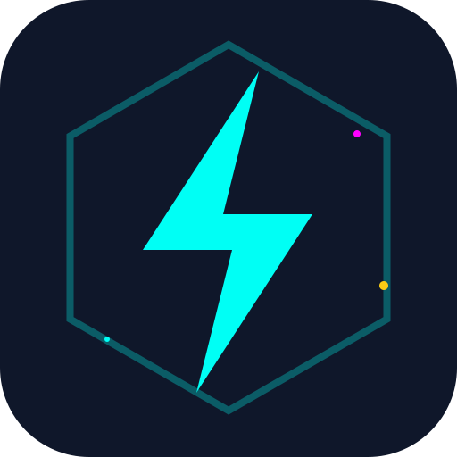

# ⚡ IdeaBlast Companion

> Local AI desktop app powered by Tauri v2 + React — designed for Windows users running Ollama locally.



## Overview

IdeaBlast Companion is a lightweight native Windows application that connects to your **local Ollama instance** with zero configuration. It auto-discovers available models and provides a sleek cyberpunk-themed interface to interact with them.

**Plug & Play** — If Ollama is running, you're ready to go.

## Features

- 🔍 **Auto-Discovery** — Automatically detects Ollama on `localhost:11434` at startup
- 🔄 **Model Switcher** — Instantly switch between locally available models
- 🎨 **Neon/Hacker UI** — Cyberpunk-themed interface with glitch effects
- 📦 **Native Windows App** — Distributable as `.msi` or `.exe` installer
- 🔒 **Privacy-First** — All AI processing stays local. No data leaves your machine.

## Prerequisites

- [Ollama](https://ollama.ai/) installed and running locally (port `11434`)
- At least one model pulled (e.g. `ollama pull llama3`)

## Tech Stack

| Layer      | Technology           |
|------------|----------------------|
| Runtime    | Tauri v2 (Rust)      |
| Frontend   | React 18 + TypeScript|
| Bundler    | Vite 5               |
| Styling    | Custom CSS (Neon)    |
| AI Backend | Ollama (local)       |

## Development

### Requirements

- **Node.js** >= 20.x
- **Rust** (latest stable) — [Install via rustup](https://rustup.rs/)
- **Tauri CLI** — included as a dev dependency

### Setup

```bash
# Clone the repo
git clone https://github.com/Nurkan1/IdeaBlast_Companion.git
cd IdeaBlast_Companion

# Install frontend dependencies
npm install

# Run in development mode (starts Vite + Tauri)
npm run tauri dev
```

### Build for Windows

```bash
# Produces .msi and .exe installers in src-tauri/target/release/bundle/
npm run tauri build
```

## Project Structure

```
IdeaBlast_Companion/
├── public/                  # Static assets (logo, icons)
├── src/
│   ├── components/          # React UI components
│   │   ├── ModelSwitcher.tsx
│   │   └── OllamaOfflineBanner.tsx
│   ├── hooks/
│   │   └── useOllamaDiscovery.ts   # Auto-discovery hook
│   ├── App.tsx              # Root component
│   ├── main.tsx             # Entry point
│   └── styles.css           # Neon/Hacker theme
├── src-tauri/
│   ├── capabilities/        # Tauri permission allow-lists
│   ├── icons/               # App icons for Windows installer
│   ├── src/                 # Rust backend
│   └── tauri.conf.json      # Tauri build & bundle config
├── index.html
├── package.json
└── vite.config.ts
```

## License

MIT

---

<p align="center">
  Built with ⚡ by <a href="https://github.com/Nurkan1">Nurkan1</a>
</p>
