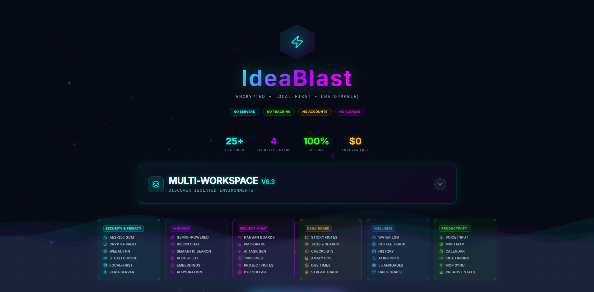

# IdeaBlast Companion

> The native desktop AI assistant for **[IdeaBlast](https://ideablast.app)** — connects your local AI models (Ollama) to IdeaBlast via MCP (Model Context Protocol).

<p align="center">
  
</p>

## What is this?

IdeaBlast Companion is a **free, open-source desktop app** that turns any local AI model into a powerful assistant for IdeaBlast. It runs 100% locally — zero cloud, zero tracking, zero subscriptions.

**You bring your own AI.** Any model running on Ollama works: Gemma, Llama, Mistral, Qwen, Phi, DeepSeek, etc.

## Quick Start (3 steps)

### 1. Install Ollama
Download from [ollama.ai](https://ollama.ai/) and pull a model:
```bash
ollama pull gemma3:4b
```

### 2. Install IdeaBlast Companion
Download the latest installer from [Releases](https://github.com/Nurkan1/IdeaBlast_Companion/releases):
- **Windows**: `.exe` installer (recommended) or `.msi`
- **Linux** (Kali, Ubuntu, Debian): `.deb` package or `.AppImage` (universal)

```bash
# Linux .deb install
sudo dpkg -i IdeaBlast.Companion_1.2.0_amd64.deb

# Linux AppImage (no install needed)
chmod +x IdeaBlast.Companion_1.2.0_amd64.AppImage
./IdeaBlast.Companion_1.2.0_amd64.AppImage
```

### 3. Connect to IdeaBlast
1. Open [IdeaBlast](https://ideablast.app) in your browser
2. Click the MCP Sync icon in the header to enable it
3. Open IdeaBlast Companion — it connects automatically

That's it. Start chatting with your local AI to manage your ideas.

## What's new in v1.2.0

- **Persistent conversation history** — pick a folder on first launch; every chat is auto-saved as JSON to your local disk. Reload, rename, delete, or export to Markdown anytime.
- **History sidebar** with built-in search — find any past conversation in seconds.
- **Light & Dark themes** — toggle from the sidebar; preference is remembered.
- **Markdown rendering** for AI responses — tables, code blocks, lists, links, blockquotes (GFM).
- **Glassmorphism UI** — refined sidebar/toolbar with subtle blur and the IdeaBlast accent gradient.
- **Smooth animations** — fade-in messages, animated typing indicator.
- **Keyboard shortcuts** — `Ctrl+N` new chat, `Ctrl+S` save current conversation.
- **Open conversations folder** in your system file manager with one click.
- All MCP integrations with IdeaBlast remain fully intact and unchanged.

## Features

### Intelligent AI — Understands Natural Language
No need to memorize commands. Just talk naturally in any language:
- "What do I have saved?" → reads your ideas
- "Give me 5 ideas about marketing" → brainstorms and saves them
- "Get rid of all that" → shows delete preview + asks confirmation
- "How productive was I this week?" → weekly summary

The system uses **hybrid intent detection**: fast regex for common commands + LLM classification fallback for natural language. Works with any phrasing, any language, typos included.

### AI Chat with Local Models
- Auto-discovers Ollama on `localhost:11434`
- Switch between any installed model instantly
- Streaming responses in real-time
- Attach local files (code, text, images) as context
- **Markdown rendering** with tables, code blocks, lists and links (GFM)
- **Copy any response** with one click
- **New Chat** button to start fresh conversations

### Persistent Conversations *(new in 1.2.0)*
- Pick any folder on your machine — IdeaBlast Companion saves chats there as JSON
- Auto-save after every assistant response
- **Searchable history sidebar** with rename, delete, and export
- **Export to Markdown** for sharing or archiving
- **Open folder** in your system file manager from the sidebar
- 100% local files — nothing ever leaves your machine

### Modern UI *(new in 1.2.0)*
- **Light & Dark themes** with one-click toggle, persisted across sessions
- Glassmorphism sidebar and toolbar
- Smooth message fade-in and animated typing indicator
- Keyboard shortcuts: `Ctrl+N` new chat · `Ctrl+S` save

### Full IdeaBlast Integration via MCP

Every IdeaBlast feature is accessible from the chat:

| Action | Examples |
|--------|----------|
| Read ideas | "show my ideas", "what do I have?", "list everything" |
| Search | "search ideas about React", "find anything related to AI" |
| Create idea | "create an idea about...", "save this thought: ..." |
| Create plan | "create a plan to learn Tauri in 2 weeks" |
| Brainstorm | "give me 5 ideas about productivity", "brainstorm marketing" |
| Delete | "delete them", "remove the last 3", "borra todo" |
| Mark done | "mark as done", "complete all ideas" |
| Add tags | "add tags: frontend, react" |
| Set deadline | "set deadline to friday", "due in 3 days" |
| Kanban | "show kanban board", "create card: Fix login bug" |
| Daily notes | "show my notes", "plan my day: meeting, review, deploy" |
| Stats | "show my stats", "how productive am I?" |
| Weekly review | "weekly summary", "what did I do this week?" |
| Mind map | "create a mind map for this idea" |

### Smart Safety for Dangerous Actions

Delete operations always show a preview first and ask for confirmation:

```
User: "delete all my ideas"

AI: DELETE PREVIEW — 12 ideas will be permanently deleted:
  1. Learn React hooks [#frontend]
  2. Design new landing page [#design]
  3. Fix authentication bug [#backend, #urgent]
  ...

Say "yes" to confirm or "no" to cancel.

User: "yes"

AI: 12 ideas deleted
```

### Multilingual Support
Full support for English and Spanish commands, dates, and responses. The AI responds in whatever language you write in.

### Attach Local Files
Click the paperclip button to attach files as context:
- **Code**: `.js`, `.ts`, `.py`, `.rs`, `.json`, `.html`, `.css`, etc.
- **Documents**: `.txt`, `.md`, `.csv`, `.yaml`, `.toml`
- **Images**: `.png`, `.jpg`, `.gif`, `.webp`

Example: Attach a `requirements.txt` and say "create a plan for this project" — the AI reads the file and generates a specific plan based on its contents.

## Supported Platforms

| Platform | Format | Notes |
|----------|--------|-------|
| Windows 10/11 | `.exe` / `.msi` | Recommended: `.exe` installer |
| Kali Linux | `.deb` | `sudo dpkg -i` |
| Ubuntu / Debian | `.deb` | `sudo dpkg -i` |
| Any Linux | `.AppImage` | Universal, no install needed |

## Supported Models

Any Ollama model works. Recommended:

| Model | Size | Best for |
|-------|------|----------|
| `gemma3:4b` | 3.1 GB | Fast responses, good for planning |
| `gemma3:12b` | 8.1 GB | Better quality, still fast |
| `llama3.1:8b` | 4.7 GB | Great all-round model |
| `mistral:7b` | 4.1 GB | Good for creative brainstorming |
| `qwen2.5:7b` | 4.7 GB | Strong reasoning |
| `deepseek-r1:8b` | 4.9 GB | Advanced reasoning |

Pull any model with:
```bash
ollama pull gemma3:4b
```

## Tech Stack

| Layer | Technology |
|-------|-----------|
| Runtime | Tauri v2 (Rust) |
| Frontend | React 18 + TypeScript |
| Bundler | Vite 5 |
| AI Backend | Ollama (local) |
| Integration | MCP (Model Context Protocol) |
| CI/CD | GitHub Actions (Windows + Linux) |
| Styling | Custom Cyberpunk CSS |

## Development

### Requirements
- **Node.js** >= 22.x
- **Rust** (latest stable) — [Install via rustup](https://rustup.rs/)
- **Ollama** — [Install from ollama.ai](https://ollama.ai/)

### Setup
```bash
git clone https://github.com/Nurkan1/IdeaBlast_Companion.git
cd IdeaBlast_Companion
npm install
npm run tauri dev
```

### Build
```bash
# Windows: produces .msi and .exe installers
# Linux: produces .deb and .AppImage
npm run tauri build
```

## Project Structure

```
IdeaBlast_Companion/
├── src/
│   ├── components/
│   │   ├── ChatPanel.tsx          # Chat UI, markdown render, toolbar
│   │   ├── HistorySidebar.tsx     # Conversation history list + search
│   │   └── FolderPickerModal.tsx  # First-launch folder picker
│   ├── hooks/
│   │   ├── useChat.ts             # Chat + MCP integration + save/load
│   │   ├── useOllamaDiscovery.ts  # Ollama auto-detection
│   │   └── useMcpStatus.ts        # MCP server health polling
│   ├── lib/
│   │   ├── mcpBrain.ts            # Hybrid intent detection + MCP tools
│   │   ├── mcpClient.ts           # MCP file I/O (inbox, snapshot, actions)
│   │   ├── conversationStore.ts   # Save/load/list conversations
│   │   ├── markdownExport.ts      # Conversation → Markdown export
│   │   ├── settings.ts            # App settings (theme, folder, autosave)
│   │   └── httpProxy.ts           # CORS bypass via Rust
│   ├── App.tsx
│   └── styles.css                 # Cyberpunk dark theme
├── src-tauri/
│   ├── src/lib.rs                 # Rust backend (Ollama, MCP, file reading)
│   └── tauri.conf.json
├── .github/workflows/
│   └── release.yml                # CI/CD: auto-build Windows + Linux
├── package.json
└── vite.config.ts
```

## Architecture

```
User Input → ChatPanel → useChat hook
                            ↓
                     mcpBrain.processWithMcp()
                     ├── Detect intent (hybrid: regex + LLM fallback)
                     ├── Check pending confirmations
                     ├── Execute MCP tool
                     │   ├── Read snapshot.json
                     │   ├── Write inbox.json (create)
                     │   └── Write actions.json (update/delete)
                     └── Build system prompt with context
                            ↓
                     Ollama (streaming via Tauri)
                            ↓
                     postProcess (if needed)
                     ├── Parse LLM response
                     ├── Create ideas/plans/diagrams
                     └── Emit progress updates to UI
```

## Privacy & Security

- All AI processing happens locally on your machine
- HTTP requests restricted to `localhost` only (ports 11434 and 3456)
- No telemetry, no analytics, no cloud services
- MCP data stays in local files on your filesystem
- Open source — audit the code yourself

## License

MIT

---

<p align="center">
  Made for <a href="https://ideablast.app">IdeaBlast</a> · Built with Tauri + Ollama + MCP by <a href="https://github.com/Nurkan1">PYSBG</a>
</p>
